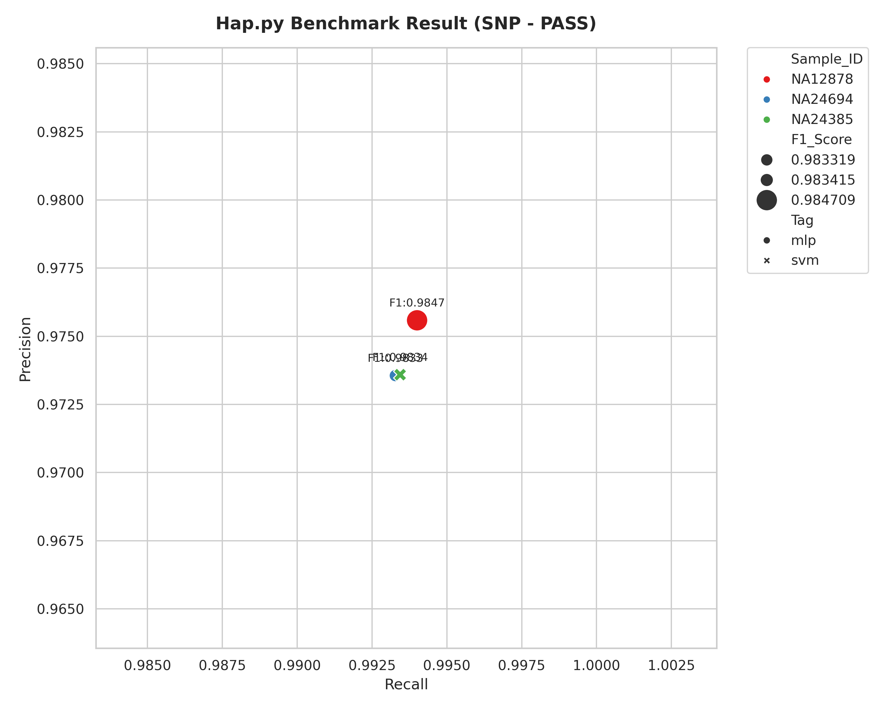
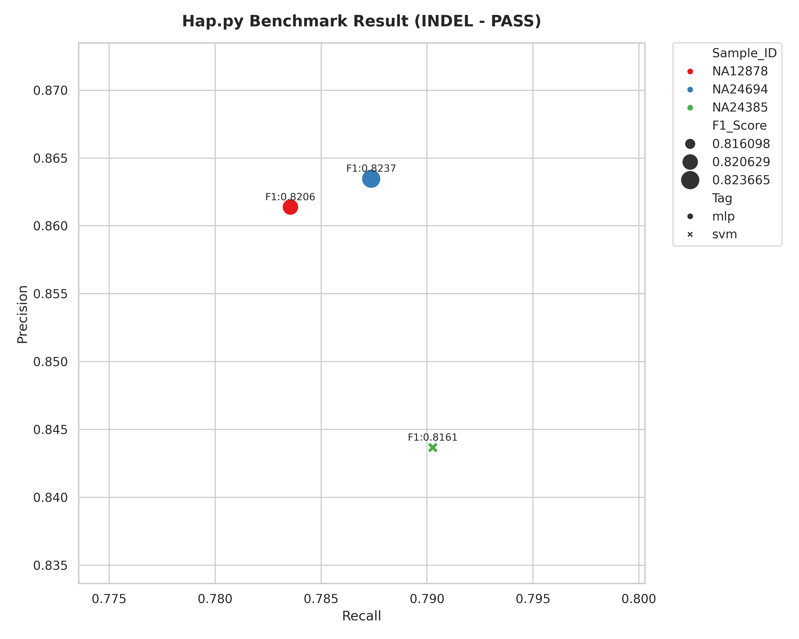

# variant-filter-make

A small toolkit for building and applying machine learning filters to VCF variant calls.

## Overview

This repository contains four main scripts:

- `extract_features.py` — generate SNP and INDEL feature matrices from VCF data using `bcftools`.
- `train_model.py` — train a machine learning model from one or more feature matrix TSV files.
- `apply_model.py` — apply a trained model to a VCF file and add a machine learning filter tag.
- `plot_hap.py` — plot hap.py benchmark summary metrics for multiple samples.

The example workflow is shown in `example.sh`.

## Requirements

- `Python 3`
- `bcftools`
- `pysam`
- `pandas`
- `scikit-learn`
- `matplotlib`
- `yaml` / `PyYAML`
- [hap.py](https://github.com/Illumina/hap.py) (for benchmark summary generation)

## Script usage

### 1. `extract_features.py`

Generate SNP and INDEL feature matrices from a target VCF, truth VCF, and BED region file.

```bash
python extract_features.py \
   /path/to/your_data_NA12878.vcf.gz \
  /path/to/NA12878_benchmark.vcf.gz \
  /path/to/NA12878_highconf.bed \
  output_prefix/NA12878 \
  -s NA12878 \
  -f ".,PASS" \
  --info-flags-snp "QD,MQ,FS,MQRankSum,ReadPosRankSum,SOR" \
  --info-flags-indel "QD,MQ,FS,MQRankSum,ReadPosRankSum,SOR" 
```

This produces:

- `output_prefix/NA12878_snp_feature_matrix.tsv`
- `output_prefix/NA12878_indel_feature_matrix.tsv`

Notes on key parameters:

- `--info-flags-snp` / `--info-flags-indel`: comma-separated list of VCF `INFO` tags to include as features in the output matrix (for example: `QD,MQ,FS,MQRankSum,ReadPosRankSum,SOR`). These correspond to fields produced by `bcftools query` and become numeric columns in the TSV file.

- `-f` / `--vcf-filter-flag` (used by `extract_features.py`): controls which VCF records are selected by `bcftools isec` when building matrices. You can pass a single value or a comma-separated list. Examples:
  - `PASS`: include only records with filter value `PASS`.
  - `.` or `.,PASS`: `.` denotes unfiltered records (no FILTER value). `".,PASS"` includes both unfiltered and `PASS` records.
  In short: pass the same style used by `bcftools isec -f` to select records by their FILTER field.

### 2. `train_model.py`

Train a model from one or more feature matrix TSV files.

```bash
python train_model.py -i \
  NA12878_snp_feature_matrix.tsv \
  NA24694_snp_feature_matrix.tsv \
  -o model_model.pkl \
  -m mlp \
  --info-flags "QD,MQ,FS,MQRankSum,ReadPosRankSum,SOR" \
  -c train_model_config.yaml
```

- `-m`, `--model`: choose which model architecture to train. Supported values are `random_forest`, `logistic_regression`, `svm`, and `mlp`.
- `--info-flags`: comma-separated list of feature columns to use from the input TSV matrices. If provided, training will use only those INFO feature columns in the order specified.

### 3. `apply_model.py`

Apply the trained model to a VCF file and write filtered output.

```bash
python apply_model.py \
  -i your_data_NA12878.vcf.gz \
  -o NA12878_filtered_snp.vcf.gz \
  -m model_model.pkl \  
  -t snp \
  -F
```

Use `-t indel` for INDEL filtering and `-F` to overwrite existing VCF filters with the model filter.

### 4. `plot_hap.py`

Plot [hap.py](https://github.com/Illumina/hap.py) summary metrics for multiple samples. Provide matching `sample_id` and `tag` lists for each input summary CSV file.

```bash
python plot_hap.py \
  -i NA12878_happy.summary.csv NA24694_happy.summary.csv NA24385_happy.summary.csv \
  -s NA12878 NA24694 NA24385 \
  -t mlp mlp svm \
  --type SNP \
  --filter PASS \
  -o snp_hap_summary.png
```

The command above reads multiple `hap.py` summary CSV files and plots metrics including recall, precision, and F1 score. The sample IDs and tags are used to distinguish points in the plot.

## Example workflow

The file `example.sh` includes a full example workflow that:

1. extracts features for several samples,
2. trains a model using feature matrices,
3. applies the model to SNP and INDEL VCFs,
4. runs `hap.py` benchmarking and writes summary CSV output,
5. plots the benchmark metrics with `plot_hap.py`.

## Examples: plots

SNP benchmark plot:



INDEL benchmark plot:



## Notes

- `extract_features.py` uses `bcftools isec` and `bcftools query` to build matrices.
- `train_model.py` trains on the full combined dataset and saves a Python pickle model.
- `apply_model.py` reads the saved model and labels variants in the input VCF.
- `plot_hap.py` expects the same number of `--sample-ids` and `--tags` as input summary CSV files.

## Configuration: `train_model_config.yaml`

The repository includes a sample configuration file `train_model_config.yaml` to pass hyperparameters to `train_model.py` via the `-c` option. Below is an excerpt of the file showing the supported models and example settings:

```yaml
# Random Forest
random_forest:
  n_estimators: 200
  max_depth: 12
  min_samples_split: 5

# Logistic Regression
logistic_regression:
  C: 1.0
  penalty: "l2"

# SVM
svm:
  C: 1.0
  kernel: "rbf"

# MLP (Neural Network)
mlp:
  hidden_layer_sizes: [128, 64, 32]
  activation: "relu"
  learning_rate_init: 0.001
```

- Supported models: `random_forest`, `logistic_regression`, `svm`, `mlp`.
- To use these parameters, pass the config file when running `train_model.py`, for example:

```bash
python train_model.py -i matrix1.tsv matrix2.tsv -o model.pkl -m mlp -c train_model_config.yaml
```

- Notes:
  - Each top-level key in the YAML must match one of the supported model names. When `train_model.py` finds a section matching the chosen `--model`, it will pass those key/value pairs to the scikit-learn estimator constructor.
  - For `mlp`, the script converts `hidden_layer_sizes` (YAML list) into a Python tuple automatically.
  - You can edit the numeric hyperparameters (e.g., `n_estimators`, `max_depth`, `C`, `learning_rate_init`, etc.) to tune performance. Larger models or more iterations may increase runtime and memory use.

These scripts will be organized as a pipeline by snakemake or wdl.