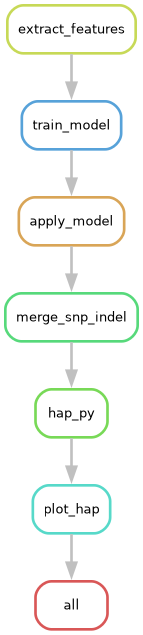
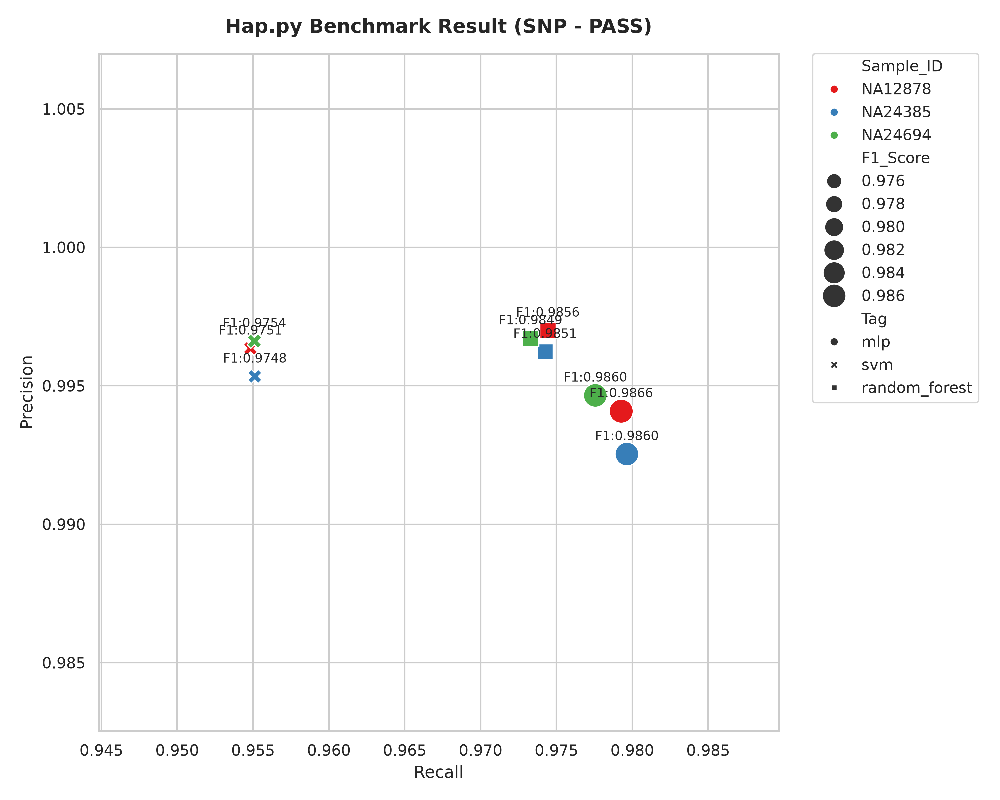
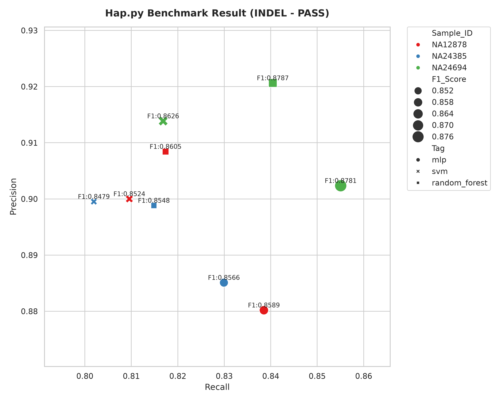

# variant-filter-make

A Snakemake workflow for training machine learning models to filter genomic variants (SNPs and INDELs) in VCF files. The workflow extracts features from variant calls, trains ML classifiers using truth sets, applies the models to benchmark samples, and evaluates performance using [hap.py](https://github.com/Illumina/hap.py).

## Overview

This pipeline implements a supervised learning approach for variant quality filtering:

1. **Feature Extraction** — Extract VCF INFO field features (QD, MQ, FS, MQRankSum, ReadPosRankSum, SOR) from training samples with known truth sets
2. **Model Training** — Train ML models (MLP, SVM, Random Forest) on the extracted features
3. **Model Application** — Apply trained models to benchmark/test VCF files to predict variant quality
4. **Benchmarking** — Evaluate filtered VCFs against truth sets using hap.py
5. **Visualization** — Generate summary plots comparing model performance across samples

## Parallelization Strategy

The workflow is designed to maximize parallel execution across multiple dimensions:

**Training Phase:**
- **By variant type**: SNP and INDEL feature extraction, model training, and model application run in parallel
- **By model**: All configured models (mlp, svm, random_forest, logistic_regression) train simultaneously for each variant type
- **By sample**: Feature extraction runs in parallel across all training samples

**Benchmarking Phase:**
- **By sample**: hap.py evaluation runs in parallel for each benchmark sample
- **By model**: Each model's predictions are evaluated independently and simultaneously

This design means that with sufficient CPU cores, the workflow can process multiple models × variant types × samples concurrently, significantly reducing total runtime. For example, if you configure 4 models and have 3 benchmark samples, the hap.py stage will run up to 12 jobs in parallel (4 models × 3 samples).

To take advantage of this parallelization, specify an appropriate number of cores when running snakemake:

```bash
snakemake --cores 16 --use-conda
```

## Workflow DAG
extract_features → train_model → apply_model → merge_snp_indel → hap_py → plot_hap  



real data workflow dag  


## Directory Structure

```
.
├── config/
│   ├── config.yaml              # Main workflow configuration
│   ├── samplesheet.tsv          # Sample information (training & benchmark)
│   └── train_model_config.yaml  # Model hyperparameters
├── workflow/
│   ├── Snakefile                # Snakemake workflow definition
│   ├── envs/
│   │   └── common.yaml          # Conda environment for all rules
│   └── scripts/
│       ├── extract_features.py  # Feature extraction from VCFs
│       ├── train_model.py       # ML model training
│       ├── apply_model.py       # Apply model to VCFs
│       └── plot_hap.py          # Benchmark visualization
├── inputs/                      # Input VCFs and BED files (user-provided)
├── results/                     # Output directory (auto-generated)
└── screenshots/
    ├── dag.png                  # Workflow DAG visualization
    ├── example_apply_snp_happy_summary.png
    └── example_apply_indel_happy_summary.png
```

## Requirements

The workflow uses Snakemake's conda environment management. Each rule automatically uses the dependencies defined in `workflow/envs/common.yaml`.

**Host environment (minimal):**
- [Snakemake](https://snakemake.readthedocs.io/) (>=7.0)
- Python 3.x with `pandas` (for parsing the samplesheet at workflow startup)

**Conda-managed dependencies (auto-installed via `--use-conda`):**
- bcftools
- pysam
- scikit-learn
- pandas
- seaborn
- numpy
- pyyaml

## Quick Start

### 1. Prepare Input Files

Create a `samplesheet.tsv` file with the following columns:

| Column | Description |
|--------|-------------|
| `sample_id` | Unique sample identifier |
| `purpose` | `train` or `bench` |
| `query_vcf` | Path to query VCF (gzipped) |
| `query_vcf_index` | Path to VCF index (.csi or .tbi) |
| `truth_vcf` | Path to truth VCF (gzipped) |
| `truth_vcf_index` | Path to truth VCF index |
| `bed` | Path to confident regions BED file |

Example:
```tsv
sample_id	purpose	query_vcf	query_vcf_index	truth_vcf	truth_vcf_index	bed
NA12878	train	inputs/vcfs/NA12878.chr1.train.vcf.gz	inputs/vcfs/NA12878.chr1.train.vcf.gz.csi	inputs/vcfs/NA12878.truth.vcf.gz	inputs/vcfs/NA12878.truth.vcf.gz.tbi	inputs/beds/NA12878_train_chr1.bed
NA12878	bench	inputs/vcfs/NA12878.chr2.test.vcf.gz	inputs/vcfs/NA12878.chr2.test.vcf.gz.csi	inputs/vcfs/NA12878.truth.vcf.gz	inputs/vcfs/NA12878.truth.vcf.gz.tbi	inputs/beds/NA12878_test_chr2.bed
```

### 2. Configure the Workflow

Edit `config/config.yaml` to set:

- `samplesheet`: Path to your samplesheet
- `prefix`: Output file prefix
- `extract_features`: VCF filter flags and INFO fields to extract
- `train_model`: Model names and feature flags
- `apply_model`: Batch size and filter settings
- `hap_py`: Reference genome paths

### 3. Run the Workflow

```bash
snakemake --cores your_cpu_number --use-conda
```

## Configuration

### Main Config (`config/config.yaml`)

| Parameter | Description | Default |
|-----------|-------------|---------|
| `prefix` | Output file prefix | `test_dev` |
| `extract_features.vcf_filter_flag` | VCF FILTER values to include | `.,PASS,MLrejected` |
| `extract_features.info_flags_snp` | SNP INFO fields to extract | `QD,MQ,FS,MQRankSum,ReadPosRankSum,SOR` |
| `extract_features.info_flags_indel` | INDEL INFO fields to extract | `QD,MQ,FS,MQRankSum,ReadPosRankSum,SOR` |
| `train_model.model_names` | ML models to train | `mlp,svm,random_forest` |
| `apply_model.batch_size` | Variants per batch | `10000` |
| `apply_model.overwrite_filter` | Overwrite existing FILTER tags | `true` |
| `apply_model.filter_name_prefix` | Prefix for ML filter tags | `ML` |

### Supported Models

- **mlp** — Multi-Layer Perceptron
- **svm** — Support Vector Machine
- **random_forest** — Random Forest Classifier
- **logistic_regression** — Logistic Regression Classifier

Model training hyperparameters (e.g., number of estimators, learning rate, hidden layer sizes) are configured in `config/train_model_config.yaml`. You can tune these parameters to optimize performance for your specific data. More scikit-learn model types will be supported in future releases.


## Output

The workflow generates:

- `results/features/` — Extracted feature matrices (TSV)
- `results/models/` — Trained model files (PKL)
- `results/apply/` — VCFs with ML-based FILTER annotations
- `results/merge_apply/` — Merged SNP + INDEL VCFs
- `results/happy/` — hap.py benchmark results (CSV)
- `results/happy_plot/` — Summary plots (PNG)

## Example Output

Example benchmark plots generated by the workflow:

**SNP Performance:**


**INDEL Performance:**


## Standalone Usage: Apply a Trained Model to New VCFs

Once you have evaluated the benchmark results and selected the best model, you can use `workflow/scripts/apply_model.py` directly on any new VCF file **without running the full Snakemake workflow**.

```bash
python workflow/scripts/apply_model.py \
    -i your_new_variants.vcf.gz \
    -m results/models/<prefix>_<model_name>_apply_<snp|indel>.pkl \
    -o filtered_output.vcf.gz \
    -t <snp|indel> \
    -f ML \
    -F
```

| Argument | Description |
|----------|-------------|
| `-i` | Input VCF file (gzipped) |
| `-m` | Trained model file (`.pkl`) |
| `-o` | Output filtered VCF file |
| `-t` | Variant type: `snp` or `indel` |
| `-f` | FILTER tag to apply when the model predicts FAIL |
| `-F` | Overwrite existing FILTER tags (optional) |
| `-b` | Batch size for processing (default: 10000) |

**Dependencies:** This script only requires `pandas` and `pysam` — no Snakemake installation needed.

## License

See [LICENSE](LICENSE).