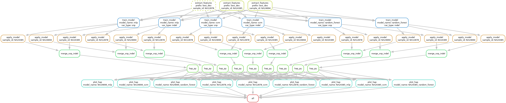

# variant-filter-make

A Snakemake workflow for training machine learning models to filter genomic variants (SNPs and INDELs) in VCF files. The workflow extracts features from variant calls, trains ML classifiers using truth sets, applies the models to benchmark samples, and evaluates performance using [hap.py](https://github.com/Illumina/hap.py).

## Overview

This pipeline implements a supervised learning approach for variant quality filtering:

1. **Feature Extraction** — Extract VCF INFO field features (QD, MQ, FS, MQRankSum, ReadPosRankSum, SOR) from training samples with known truth sets
2. **Model Training** — Train ML models (MLP, SVM, Random Forest) on the extracted features
3. **Model Application** — Apply trained models to benchmark/test VCF files to predict variant quality
4. **Benchmarking** — Evaluate filtered VCFs against truth sets using hap.py
5. **Visualization** — Generate summary plots comparing model performance across samples

## Workflow DAG
extract_features → train_model → apply_model → merge_snp_indel → hap_py → plot_hap


## Directory Structure

```
.
├── config/
│   ├── config.yaml              # Main workflow configuration
│   ├── samplesheet.tsv          # Sample information (training & benchmark)
│   └── train_model_config.yaml  # Model hyperparameters
├── workflow/
│   ├── Snakefile                # Snakemake workflow definition
│   └── scripts/
│       ├── extract_features.py  # Feature extraction from VCFs
│       ├── train_model.py       # ML model training
│       ├── apply_model.py       # Apply model to VCFs
│       └── plot_hap.py          # Benchmark visualization
├── inputs/                      # Input VCFs and BED files (user-provided)
├── results/                     # Output directory (auto-generated)
└── screenshots/
└── dag.png                  # Workflow DAG visualization
```

## Requirements

- [Snakemake](https://snakemake.readthedocs.io/) (>=7.0)
- Python 3.x with:
  - pandas
  - scikit-learn
  - matplotlib
  - pysam
- [bcftools](https://samtools.github.io/bcftools/)
- [tabix](http://www.htslib.org/doc/tabix.html)
- [hap.py](https://github.com/Illumina/hap.py) (for benchmarking)
- Reference genome (e.g., human_g1k_v37.fasta)

## Quick Start

### 1. Prepare Input Files

Create a `samplesheet.tsv` file with the following columns:

| Column | Description |
|--------|-------------|
| `sample_id` | Unique sample identifier |
| `purpose` | `train` or `bench` |
| `query_vcf` | Path to query VCF (gzipped) |
| `query_vcf_index` | Path to VCF index (.csi or .tbi) |
| `truth_vcf` | Path to truth VCF (gzipped) |
| `truth_vcf_index` | Path to truth VCF index |
| `bed` | Path to confident regions BED file |

Example:
```tsv
sample_id	purpose	query_vcf	query_vcf_index	truth_vcf	truth_vcf_index	bed
NA12878	train	inputs/vcfs/NA12878.chr1.train.vcf.gz	inputs/vcfs/NA12878.chr1.train.vcf.gz.csi	inputs/vcfs/NA12878.truth.vcf.gz	inputs/vcfs/NA12878.truth.vcf.gz.tbi	inputs/beds/NA12878_train_chr1.bed
NA12878	bench	inputs/vcfs/NA12878.chr2.test.vcf.gz	inputs/vcfs/NA12878.chr2.test.vcf.gz.csi	inputs/vcfs/NA12878.truth.vcf.gz	inputs/vcfs/NA12878.truth.vcf.gz.tbi	inputs/beds/NA12878_test_chr2.bed
```

### 2. Configure the Workflow

Edit `config/config.yaml` to set:

- `samplesheet`: Path to your samplesheet
- `prefix`: Output file prefix
- `extract_features`: VCF filter flags and INFO fields to extract
- `train_model`: Model names and feature flags
- `apply_model`: Batch size and filter settings
- `hap_py`: Reference genome paths

### 3. Run the Workflow

```bash
snakemake --cores your_cpu_number --use-conda
```

For a dry run:
```bash
snakemake -n
```

To generate the DAG:
```bash
snakemake --dag | dot -Tpng > dag.png
```

## Configuration

### Main Config (`config/config.yaml`)

| Parameter | Description | Default |
|-----------|-------------|---------|
| `prefix` | Output file prefix | `test_dev` |
| `extract_features.vcf_filter_flag` | VCF FILTER values to include | `.,PASS,MLrejected` |
| `extract_features.info_flags_snp` | SNP INFO fields to extract | `QD,MQ,FS,MQRankSum,ReadPosRankSum,SOR` |
| `extract_features.info_flags_indel` | INDEL INFO fields to extract | `QD,MQ,FS,MQRankSum,ReadPosRankSum,SOR` |
| `train_model.model_names` | ML models to train | `mlp,svm,random_forest` |
| `apply_model.batch_size` | Variants per batch | `10000` |
| `apply_model.overwrite_filter` | Overwrite existing FILTER tags | `true` |
| `apply_model.filter_name_prefix` | Prefix for ML filter tags | `ML` |

### Supported Models

- **mlp** — Multi-Layer Perceptron
- **svm** — Support Vector Machine
- **random_forest** — Random Forest Classifier

## Output

The workflow generates:

- `results/features/` — Extracted feature matrices (TSV)
- `results/models/` — Trained model files (PKL)
- `results/apply/` — VCFs with ML-based FILTER annotations
- `results/merge_apply/` — Merged SNP + INDEL VCFs
- `results/happy/` — hap.py benchmark results (CSV)
- `results/happy_plot/` — Summary plots (PNG)

## License

See [LICENSE](LICENSE).